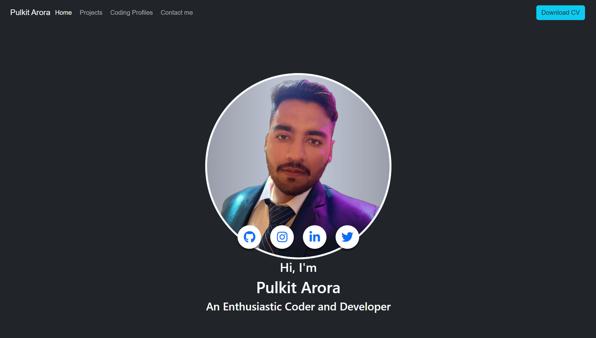
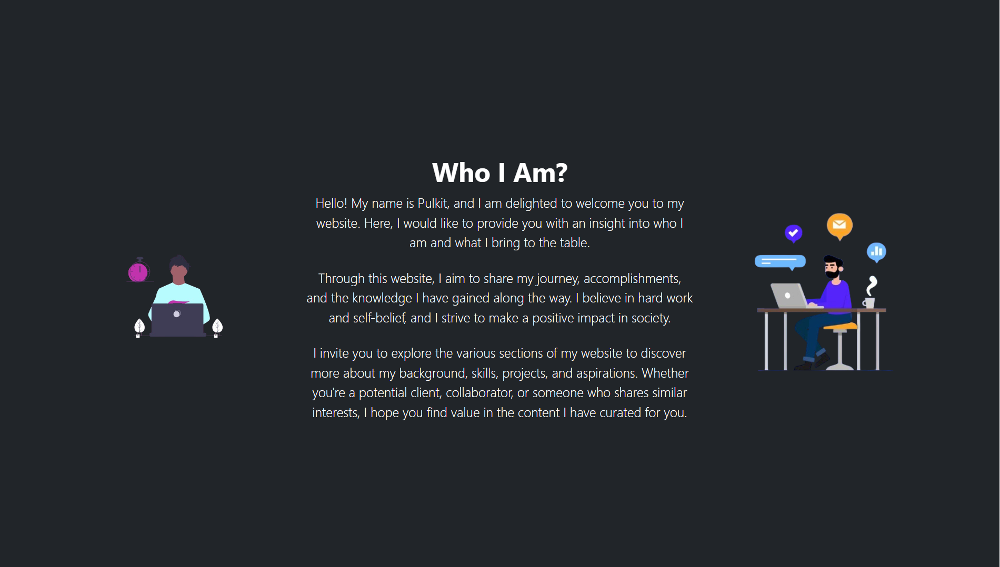
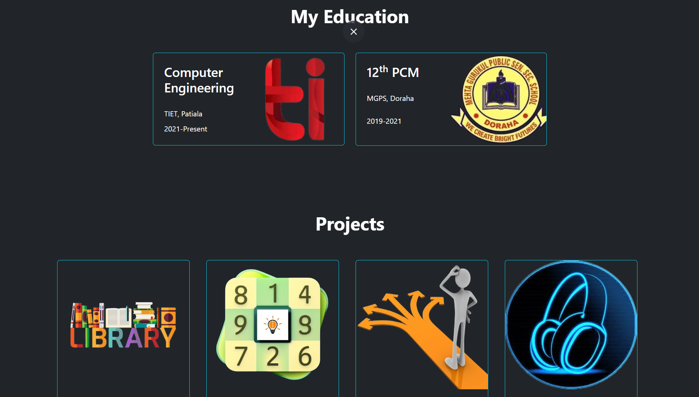
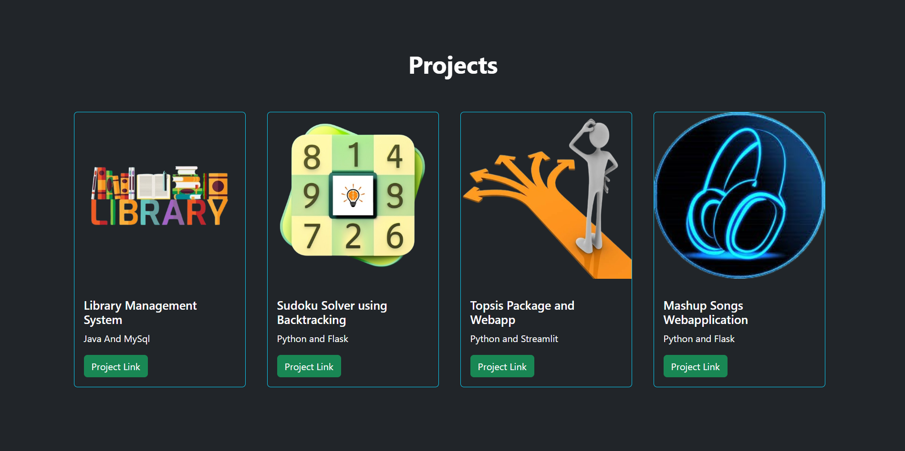
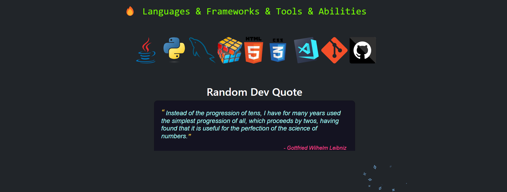
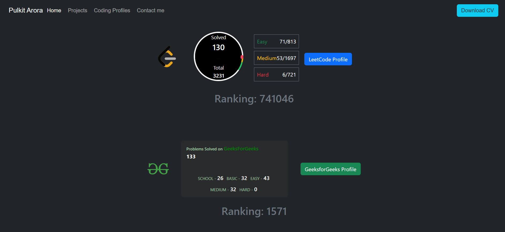
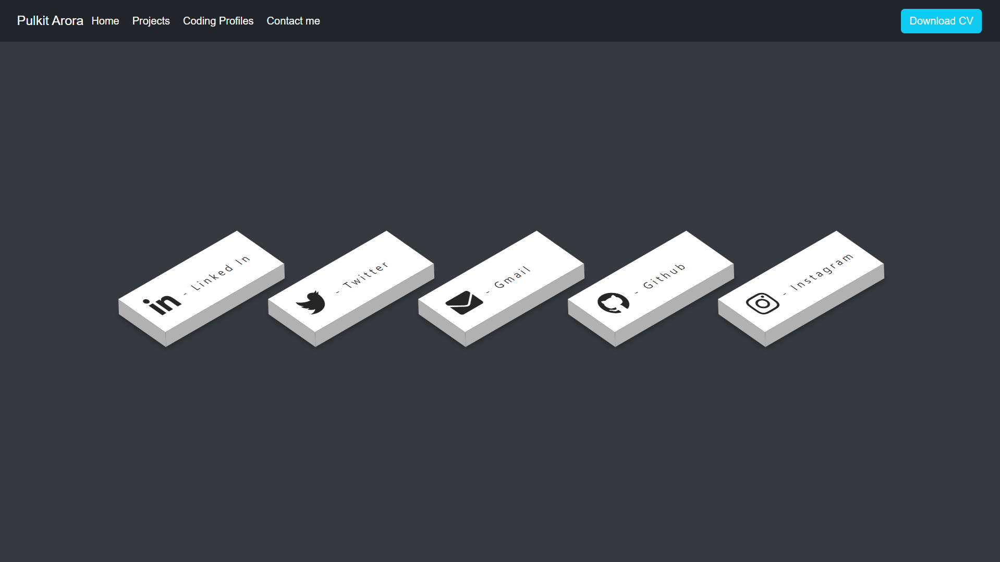

# Personal Portfolio Website

This is a personal portfolio website showcasing my projects, skills, and experiences. You can view the live site [here](https://personal-portfolio-hcq4-eilkml4uy-pulkit8690s-projects.vercel.app/).



## Table of Contents
- [Overview](#overview)
- [Features](#features)
- [Technologies Used](#technologies-used)
- [Installation](#installation)
- [Usage](#usage)
- [Images](#images)
- [Contact](#contact)

## Overview
This portfolio website serves as a platform to present my work and expertise in web development and other projects. It includes sections for my projects, skills, experience, and contact information.

## Features
- Responsive design using Bootstrap
- Interactive project showcases
- Contact form integration
- Smooth scrolling and navigation

## Technologies Used
- HTML
- CSS
- JavaScript
- Bootstrap
- Vercel (for deployment)

## Installation
To set up the project locally, follow these steps:

1. Clone the repository:
    ```bash
    git clone https://github.com/pulkit8690/Personal-Portfolio.git
    ```
2. Navigate to the project directory:
    ```bash
    cd your-repo-name
    ```
3. Install dependencies:
    ```bash
    npm install
    ```
4. Run the development server:
    ```bash
    npm run dev
    ```
5. Open your browser and visit `http://localhost:3000` to view the site.

## Usage
- Navigate through different sections using the menu.
- View detailed descriptions and images of each project.
- Use the contact form to get in touch.

## Images







## Contact
For any inquiries, please reach out via the contact form on the website or email me directly at [your-email@example.com](mailto:pulkitarora8690@gmail.com).

---

Feel free to contribute or report any issues via the repository's issue tracker.

